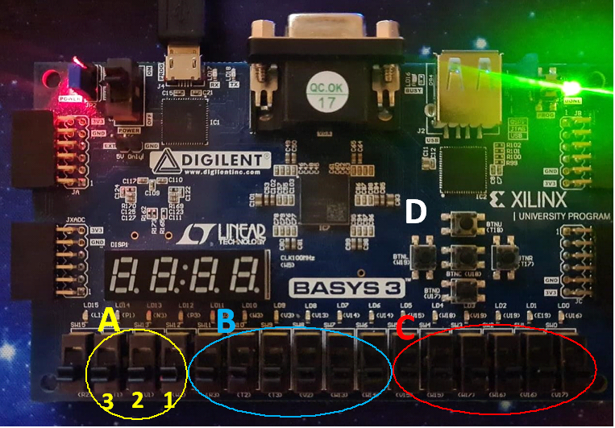
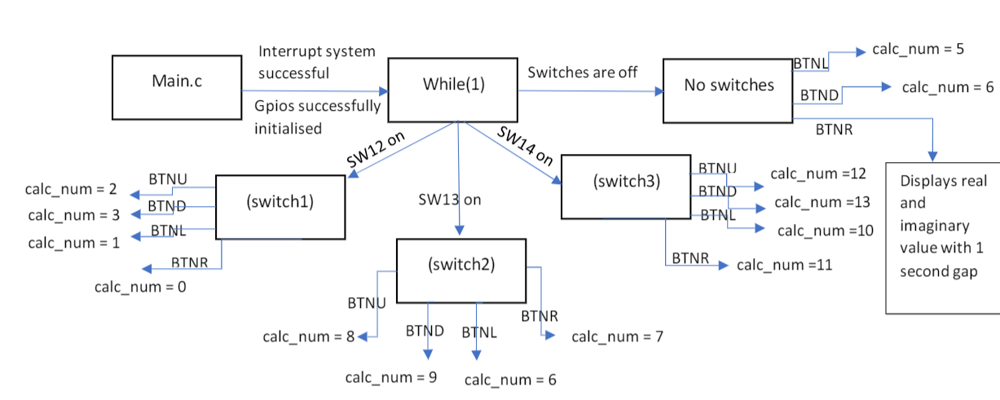

# Scientific Calculator (s1945267) Instructions for Xilinx FPGA
Created a scientific calculator using C in VHDL incorporated with Xilinx Artix-7 FPGA for Engineering Software 3 course.

## Setup and Launch

1. **Install** the GitHub codes and folder by using git clone command in the git command line
> git clone https://github.com/AmirHamzahR/Scientific_Calculator.git

2. **Setup Vivado**:
   - Launch Vivado and open the **es3_hw_assignment_1** project.
     
3. **Export Hardware**:
   - Click on **File**, navigate to **Export** > **Export Hardware**, and then select the **include bitstream** option.

4. **Launch the SDK**:
   - Click on **File** and choose **Launch SDK**.

5. **Connect the FPGA Board**:
   - Connect the FPGA board to your computer using the USB port.
   - Ensure the power switch on the board is turned on.

6. **Program the FPGA**:
   - In the Xilinx SDK, click on **Xilinx Tools**.
   - Navigate to **Program FPGA** and click **Program**.

7. **Run the Program**:
   - Click on the arrow button located next to the play button.
   - Choose and run the **ScCalculator** program.

## Basic Operation of the Calculator

### Overview

- The diagram showcases the FPGA board. It has been divided and labeled into four sections: **A**, **B**, **C**, and **D**.

### How to Use

- **Section A**:
  - Represents switches. By toggling these switches, you can choose one of the four operation modes or decide the type of output display using the buttons in **Section D**.

- **Section B & C**:
  - These sections are for input.
  - **Section B** provides a 6-bit real number input via its 6 switches.
  - **Section C** provides a 6-bit imaginary number input through its 6 switches. It can be both positive and negative.
  - All inputs will be shown on the LEDs. However, only the real number input appears on the 7-segment display.

- **Section D**:
  - Contains buttons used to select operations, as detailed in the **main.c** section of the User's guide.
  - After inputting the values and pressing the button, you must release the button to trigger the calculation.
  - To view the calculation result, turn off the switch and press while holding the right button. This will display both the real and imaginary values.
  - The center button serves as a reset function.

# Programmer's Guide

This guide provides an overview of the variables and flow used in the 6-bit complex number calculator. The codes can be found in this [folder](Calculator_codes/ScCalculator/src).

## Main Program File: `main.c`

### Header Files:

- **gpio_init.h**: For GPIO initializations.
- **seg7_display.h**: For using the `displayNumber()` function with the 7-segment display.
- **complex.h**: For complex number variables and functions.
- **xil_types.h**: For integer type definitions.

### Variables:

1. **s16 num1, num2 & slideSwitchIn**: Handle inputs. `slideSwitchIn` reads the FPGA board's 16 slide switches, while `num1` and `num2` represent imaginary and real number inputs, respectively.
2. **s16 switch1, switch2 & switch3**: Represent switches SW12, SW13, and SW14, respectively. They help choose the desired operation (see Table 1).
3. **u8 BTNU, BTND, BTNL & BTNR**: Variables corresponding to the up, down, left, and right buttons, used for operation selection.
4. **u16 counter**: Determines the time duration for displaying the answer.
5. **u16 decideI & decideR**: Decide the answer type to display (negative, positive, decimal, or whole numbers).
6. **u16 deci_R, deci_I**: Aid in determining the number type.
7. **double complex z**: Holds the output complex number.
8. **double a, b**: Represent the real and imaginary values of `z`.
9. **s16 calc_num**: Specifies the calculation type the user desires.
10. **u16 display_num**: Sets the loop range for answer display using the interrupt system.

### Functions:

- **calculation()**: Handles number input and performs the calculation.
- **displayNumber()**: Reads and displays the number on the 7-segment display.
- **input_shift()**: Transfers the first 6-bits from `slideSwitchIn` to the subsequent 6-bits.
- **value_detection()**: Explained further in [`calculations.c`](##calculations.c ).

### Operations:

| Button  | No switches | switch1 (SW12) | switch2 (SW13) | switch3 (SW14) |
|---------|-------------|----------------|----------------|----------------|
| BTNU    | No operation| Multiplication | Sine           | Natural Logarithm |
| BTND    | Reverse Division | Division | Cosine | Logarithm base 10 |
| BTNL    | Reverse Subtraction | Subtraction | Power | Tangent |
| BTNR    | Displays result | Addition | Square root | Exponential |

*Table 1: Operation Mapping*

### Flow:

- Input values are read using `XGpio_DiscreteRead()` and shifted into `num1` and `num2`.
- Inputs are displayed using `XGpio_DiscreteWrite()` with the `LEDS_OUT` variable.
- Real (`a`) and imaginary (`b`) values of `z` are evaluated.
- `value_detection()` uses pointers to call back values (`a`, `b`, `decideI`, & `decideR`) to `main.c`.
- To view answers, turn off switches and press the right button. This uses a looped counter due to the `while(1)` function characteristic.

## Other Program Files:

## calculations.h 
This header file primarily serves as an interface for the associated [`calculations.c`](##calculations.c) file. Features:
- `PI` defined for trigonometric calculations.
- Inclusion of “complex.h” for complex number calculations.
- Declaration of operation functions with uniform parameters (e.g., `void adder(double complex *, s32, s32, u16 *, u16 *);`).
- Additional functions: `displayNumber()`, `calculation()`, `input_shift()`, and `value_detection()`.

## calculations.c 
Details the implementation of functions declared in [`calculations.h`](##calculations.h). Key points:
- Utilizes void functions for operations.
- `calculation()` function employs a switch-case for operation selection.
- Complex number calculations involve specific structures and methods.
- Trigonometric functions work with radians, but user input is converted from degrees using PI.

#### Example code 1:
- Demonstrates division and the approach to represent complex numbers and their results.
- Detailed usage of variables for number representation and display handling.
- Handling of division by zero error.
- Converting trigonometric calculations from degrees to radians for user ease.

## seg7_display.c 
Manages the 7-segment display. Main features:
- Inclusions: [`seg7_display.h`](##seg7_display.h) and [`gpio_init.h`](##gpio_init.h).
- Variables: Handle display logic, number of digits, and negative numbers.
- Display logic caters to whole numbers, decimals (both positive and negative), and overly large numbers.
- Special handling for numbers resulting from division by zero.

## seg7_display.h 
Defines BCD codes for display. Notably:
- Replacement of integer 10 and 11 with `NUMBER_BLANK` and `NUMBER_DASH` respectively.

## timer_interrupt_func.c 
Leverages the [`seg_7_display.h`](##seg_7_display.h) to handle display timings:
- Uses `displayDigit()` within the `hwTimerISR` function for controlled display.

## x_interruptES3.c 
- Initializes the interrupt system for the main program.

## gpio_init.h 
Defines GPIO related variables:
- Button definitions, switch settings, LED outputs, and display formats.

## gpio_init.c 
Handles the GPIO initializations based on [`gpio_init.h`](##gpio_init.h):
- Successful initialization of GPIOs leads to their integration in the main program.

